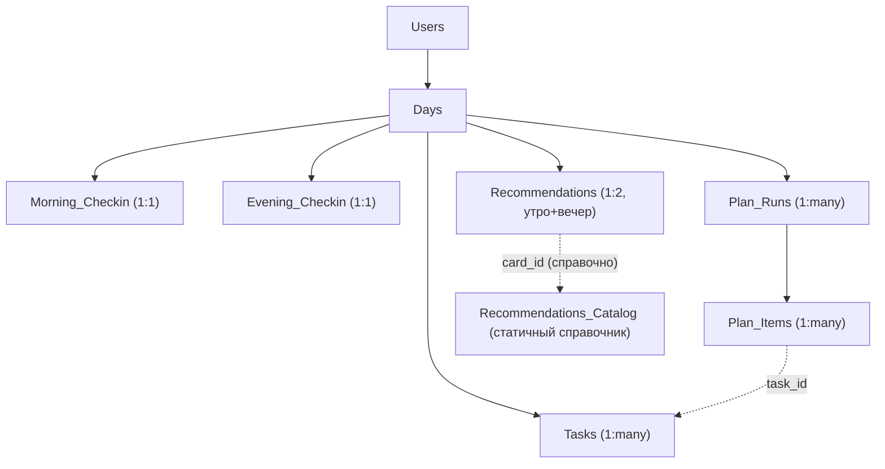

# Реляционная модель данных планировщика (Google Sheets)

Схема и ручной runbook для перехода от плоского лога `PlannerEvents` к
8 связанным листам и справочнику, готовым к переезду на Postgres/SQLite без переделок.

## Зачем

`PlannerEvents` — построчный лог всех событий (один тип события = одна
строка, всё специфичное — в JSON внутри `Raw Payload`). Это надёжно для
аудита, но плохо для аналитики вида «покажи все дни, где сон < 6 часов,
усталость ≥ 4 и выполнено > 70% задач» — придётся парсить JSON построчно.

Начиная с этой версии, **каждое событие дополнительно** (dual-write, старый
лог не отключается) раскладывается в нормализованные таблицы:

## Листы

| Лист | Ключ | Назначение |
|---|---|---|
| `Users` | `user_id` (= Participant ID) | первое/последнее появление, счётчик сессий |
| `Days` | `day_id` = `{user_id}::{date}` | «каркас» дня: ссылки на чек-ины, рекомендации, % выполнения |
| `Morning_Checkin` | `morning_checkin_id` (= `day_id`) | сон/качество/энергия/стресс/готовность/day_state |
| `Evening_Checkin` | `evening_checkin_id` (= `day_id`) | усталость/прокрастинация/трудность старта/отключение |
| `Tasks` | `task_id` (клиентский id) | одна строка на задачу; статус active/scheduled/deleted |
| `Recommendations` | `recommendation_id` = `{day_id}::{scope}` | одна строка на (день, утро/вечер): card_id, текст-снимок, helpful |
| `Plan_Runs` | `plan_run_id` | одно нажатие «Распределить»: входной объём, сколько оставлено/перенесено, readiness |
| `Plan_Items` | `plan_item_id` = `{plan_run_id}::{task_id}` | снимок решения алгоритма по каждой задаче и её последующее выполнение |
| `Recommendations_Catalog` | `card_id` | статичный справочник card_id → человекочитаемое название |

Полные списки колонок — `SHEET_COLUMNS` в `lib/planner-schema.js` (и
1:1-копия в `docs/CodeAPP.gs`).

**Осознанное отступление от исходной схемы Андрея**: в `Days` два поля
`morning_recommendation_id` / `evening_recommendation_id` вместо одного
`recommendation_id` — за день может быть два разных сценария (утро и вечер).

`PlannerEvents` не трогаем и не чистим — она остаётся архивом.

## Как события превращаются в строки

Логика — в `_recordNormalized_(data, payload)` (`docs/CodeAPP.gs`), которая
дёргается из `doPost` дополнительно к обычной записи в `PlannerEvents`, и
из `migrateLegacyEvents()` (миграция истории) — то есть живая запись и
миграция гарантированно используют один и тот же код.

| Событие | Что обновляется |
|---|---|
| `morning_checkin` | `Days` (`morning_checkin_id`) + `Morning_Checkin` |
| `evening_checkout` | `Days` (`evening_checkin_id`, `completion_percent`, `evening_recommendation_id`) + `Evening_Checkin` + `Recommendations` (scope=evening, card_id) |
| `task_created` / `task_edited` / `task_toggled` / `task_deleted` / `task_reordered` / `scheduled_added` / `scheduled_restored` / `scheduled_deleted` | upsert строки в `Tasks` по `task_id` (для `*_deleted` — не удаляем строку, ставим `status=deleted`); `task_toggled` также обновляет `completed` во всех связанных `Plan_Items` |
| `plan_generated` | массовый upsert `Tasks` + новый снимок в `Plan_Runs` и `Plan_Items` |
| `morning_embed_added` / `evening_embed_added` | upsert `Tasks` (`source=embed_suggestion`, `embed_id`) |
| `card_feedback` | upsert `Recommendations` (`helpful`, `feedback_at`) + `Days` |
| `morning_recommendation_shown` / `evening_recommendation_shown` | upsert `Recommendations` (`card_id`, `recommendation_text`, `matrix_version`) + `Days`. Отправляются клиентом (`public/planner.js`) один раз в день при первом рендере карточки — без этого `Recommendations` была бы неполной для дней, где человек не ответил «Да/Нет» |
| `routine_activated` и всё остальное | только в `PlannerEvents`, как раньше |

Если нормализованная запись упадёт (например, лист временно недоступен),
`doPost` всё равно возвращает `ok:true` — легаси-строка в `PlannerEvents`
уже сохранена к этому моменту, ошибка только логируется (`Logger.log`).

## Файлы

- **`lib/planner-schema.js`** — вся чистая логика (сборка id, merge-функции,
  патчи из payload, конвертация объект↔строка). Протестирована через
  `npm test` (`test/planner-schema.test.js`).
- **`docs/CodeAPP.gs`** — тот же код, транскрибированный вручную (Apps
  Script не поддерживает `require`), плюс код с обращениями к
  `SpreadsheetApp` (листы, upsert, `doPost`, `migrateLegacyEvents`).
  `test/planner-schema-gs-parity.test.js` **автоматически сверяет** этот
  файл с `lib/planner-schema.js` при каждом запуске `npm test` — если при
  правке одного забыть поправить второй, тест упадёт.
- **`scripts/generate-recommendations-catalog.js`** — генерирует
  `RECOMMENDATIONS_CATALOG_SEED` из `day-decision-matrix.json` /
  `day-recommendation-matrix.json` / `evening-decision-matrix.json`
  (`npm run recommendations-catalog`). При изменении текстов карточек или
  добавлении новых сценариев — перегенерировать и вставить результат
  (`output/recommendations-catalog-seed.txt`) в `RECOMMENDATIONS_CATALOG_SEED`
  внутри `docs/CodeAPP.gs`.
- **`server.js`** — `morning_recommendation_shown` / `evening_recommendation_shown`
  в `ALLOWED_EVENT_TYPES` (payload пробрасывается как есть, без изменений
  формата).
- **`public/planner.js`** — 2 новых вызова `sync(...)` при первом показе
  карточки утром/вечером за день (дедуп по дате, поля
  `morningRecommendationShownDate` / `eveningRecommendationShownDate` в
  локальном состоянии). Также обогащён payload `morning_embed_added` /
  `evening_embed_added` полями самой задачи (`id`, `duration`, `difficulty`,
  `urgency`, `slotKey`) — без этого добавленную по рекомендации задачу
  нельзя было бы отразить в `Tasks`.

## Ручной runbook (важно — живые данные)

Я не могу выполнять код в Google Apps Script и не могу сам запускать
миграцию на живой таблице — разверните код и один раз запустите миграцию
вручную, по шагам ниже.

### 1. Тест на копии таблицы

1. Откройте таблицу планировщика → **Файл → Создать копию**.
2. В копии откройте **Extensions → Apps Script**, замените содержимое
   единственного файла на новый `docs/CodeAPP.gs`, сохраните.
3. **Deploy → New deployment → Web app** (Execute as: Me, Who has access:
   Anyone), скопируйте URL веб-приложения.
4. Локально в `.env` временно укажите этот тестовый URL в
   `PLANNER_APPS_SCRIPT_URL` (и `PLANNER_APPS_SCRIPT_TOKEN`, если используете
   `SHARED_TOKEN`), запустите `npm run dev` и пройдите полный цикл в
   `/planner.html`: утренний чек-ин → создание/перенос задач → вечерний
   чек-ин → оценка «помогла рекомендация».
5. В копии таблицы проверьте: появились листы `Users`, `Days`,
   `Morning_Checkin`, `Evening_Checkin`, `Tasks`, `Recommendations`,
   `Plan_Runs`, `Plan_Items`, `Recommendations_Catalog` (последний сразу
   заполнен справочником);
   строки в них соответствуют тому, что вы сделали в интерфейсе.
6. В редакторе Apps Script выберите функцию `migrateLegacyEvents` в
   выпадающем списке → **Run**. Откройте **Executions** (или View → Logs) —
   там будет строка вида `migrateLegacyEvents: перенесено N, пропущено M из
   K строк PlannerEvents`. Проверьте, что старые события из `PlannerEvents`
   появились в новых листах.
7. Запустите `migrateLegacyEvents` повторно — числа `migrated`/`skipped`
   должны остаться теми же (upsert идемпотентен), новых дублей быть не
   должно.

### 2. Прод-деплой

1. В **продовой** таблице откройте Extensions → Apps Script, замените код
   на `docs/CodeAPP.gs`, сохраните.
2. **Deploy → Manage deployments → выбрать текущий деплой → Edit (иконка
   карандаша) → Version: New version → Deploy**. Это обновляет код за тем
   же URL, который уже используется в проде (`PLANNER_APPS_SCRIPT_URL` в
   Railway/окружении не меняется).
3. Верните `.env`/переменные окружения на прод-значения, если вы их меняли
   для шага 1.

### 3. Разовая миграция истории (прод)

1. В редакторе Apps Script (продовая таблица) выберите `migrateLegacyEvents`
   → **Run**. Разрешите запрашиваемые доступы при первом запуске.
2. Проверьте **Executions**/**Logs** на итоговую строку с числом
   перенесённых/пропущенных строк.
3. Откройте новые листы и убедитесь, что данные выглядят разумно (даты,
   `user_id`, заполненные чек-ины).

Строки без `Event Type`, без даты, без `User Name` или с `User Name =
"anonymous"` при миграции пропускаются (`skipped`) — это ожидаемо для
редких «мусорных» событий, у которых недостаточно данных для построения
`day_id`.

### Производительность (на будущее)

Каждый upsert делает линейный скан колонки-ключа
(`sheet.getRange(...).getValues()`), что нормально для пилота (сотни–тысячи
строк), но с ростом данных на очень больших листах может замедлиться.
Если это станет проблемой — следующий шаг обычно кэширование индекса
`ключ → номер строки` в `CacheService`/`PropertiesService` в рамках одного
запуска, либо собственно переезд на Postgres/SQLite (эта схема к нему
готова: те же таблицы, тот же `day_id`).

## Что осталось за скобками (можно позже)

- Подтяжка `Users` из таблицы `Participants` (имя/телефон).
- Реальный переход на Postgres/SQLite (схема к нему готова, миграция БД —
  отдельная задача).
